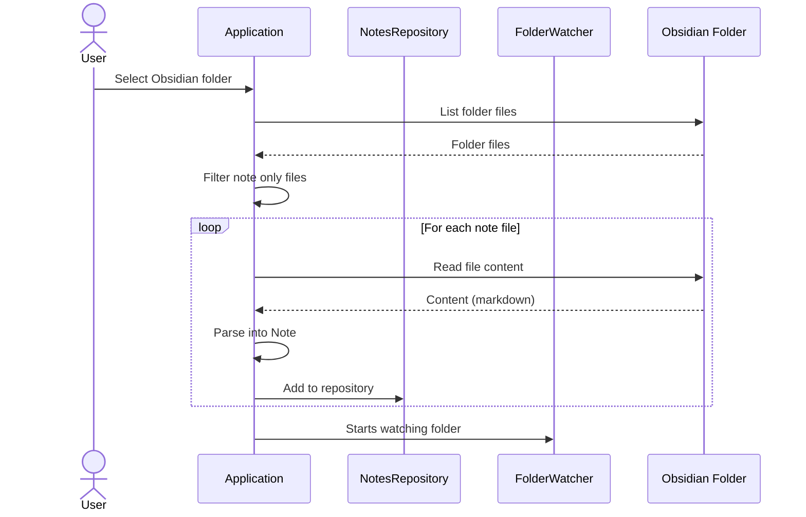
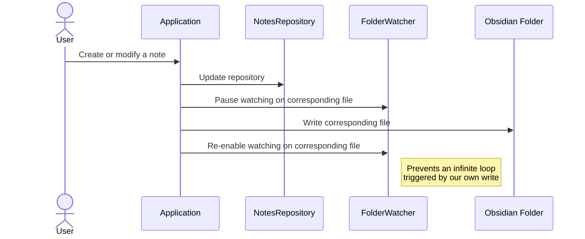
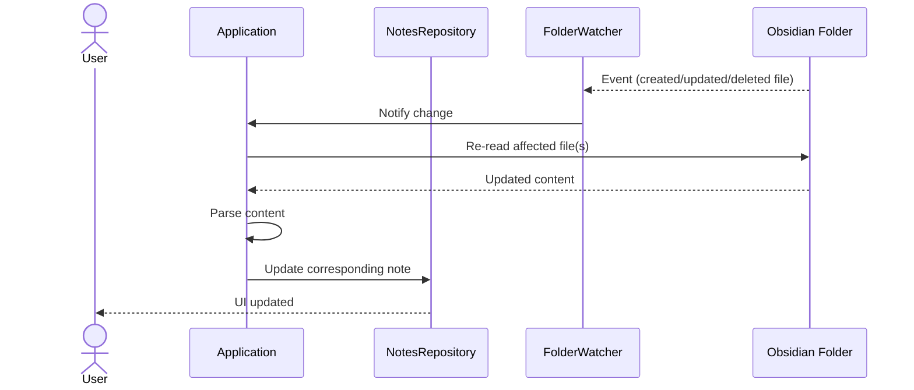

# OpenTask

A note & task management app integrated with Obsidian

## Overview

Inspired by ColorNote and Obsidian, the goal of this app is to automate life and personal knowledge management

Development still in progress for MVP, here is the overview of the minimal features needed:

- [/] UI
  - [/] All notes screen
    - [ ] sorting options
    - [x] ability to create note
  - [x] Single note screen
    - [x] ability to edit & save note
  - [/] Calendar screen
    - [ ] view daily notes on calendar
    - [x] ability to add note on specific day
  - [x] Settings screen
    - [x] select Obsidian folder
- [/] Obsidian / filesystem compatibility
  - [x] read notes from Obsidian files
  - [x] save notes as Obsidian files
  - [x] watch for changes in Obsidian files
  - [/] handle conflicts

## Data flow

WIP:

- [x] Initial exploration
- [x] Internal changes handling
- [/] External changes handling
  - [ ] note screen not updated by external changes, need debugging

### Initial exploration

Select folder, read & parse files to notes, fill up repository, setup watcher

### Internal changes handling

Create/modify from the app, update internal state and external files

### External changes handling

Create/modify from Obsidian, update internal state, handle conflicts

## Notes

- we must save the raw content of the files in the database in order to perform a diff after a FileWatcher trigger
